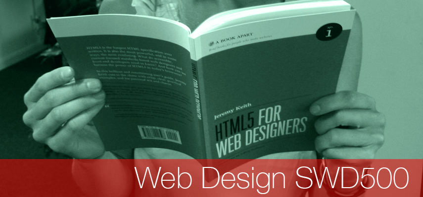

# Welcome Web Design SWD500

 - [Weekly Sessions](#weekly-sessions)
 - [About the Unit](#about-the-unit)
 - [Unit Team](#unit-team)
 - [Assessment Information & Assignment Briefs](#assessment_information_&_assignment_briefs)  
 

#Weekly Sessions

##Week 1 Introduction To The Unit

By the end of this week you should:

- Having reviewed HTML and CSS be able to lay out a basic website
- Understand the course assessment strategy 

**Session 1**

-  [Notes - HTML & CSS review](https://github.com/joeappleton18/swd500/tree/master/live_course_git_hub/Sessions/session1.0/notes.md) 

**Session 2**

- [Notes - Introduction to responsive design](https://github.com/joeappleton18/swd500/tree/master/live_course_git_hub/Sessions/session1.1) 

##Week 2 An Introduction to GIT 

By the end of this week you should:
 
- Understand what GIT and GITHUB are 
- Be able to construct a basic GIT workflow

**Session 1**

- [Notes - Introduction to version control using GIT](https://github.com/joeappleton18/swd500/tree/master/live_course_git_hub/Sessions/session2.0)
- [Practical - A Basic GIT workflow](https://github.com/joeappleton18/swd500/blob/master/live_course_git_hub/Sessions/session2.0/practical.md)

**Session 2**

- [Notes - Upping your GIT game](https://github.com/joeappleton18/swd500/blob/master/live_course_git_hub/Sessions/session2.1/notes.md)

##Week 3 Creating a professional GIT workflow

By the end of this week you should:
 
- You'll have an understanding of more advanced GIT techniques such as branching
- Be able to collaborate in a team using GIT
- You'll understand semantic HTML5 tags 
- Be able to lay out a semantically valid website 

**Session 1**

- [Notes - GIT Branching](https://github.com/joeappleton18/swd500/blob/master/live_course_git_hub/Sessions/session3.0/notes.md)
- [Practical - GIT team collaboration](https://github.com/joeappleton18/swd500/blob/master/live_course_git_hub/Sessions/session3.0/task.md)

**Session 2**

- [Notes - Semantic HTML5](https://github.com/joeappleton18/swd500/blob/master/live_course_git_hub/Sessions/session3.1/notes.md)
- [Practical - Laying out a semantic HTML page](https://github.com/joeappleton18/swd500/blob/master/live_course_git_hub/Sessions/session3.1/task.mdå)

##Week 4 - Fluid Grids

By the end of this week you should:
 
 - Understand the components of a fluid grid
 - Be able to create a fluid grid 

**Session 1 and Session 2**

There is a lot to go over this week, so the practical will spread over two sessions. 

- [Notes - Introduction to fluid grids](https://github.com/joeappleton18/swd500/blob/master/live_course_git_hub/Sessions/session4.0/notes.md)
- [Practical - Create your own grid](https://github.com/joeappleton18/swd500/blob/master/live_course_git_hub/Sessions/session4.0/task.md)

##Week 5

By the end of this week you should:
 
- Understand how to used media queries 
- Be able to construct a basic responsive website using media queries 

**Session 1**

- [Notes - The power of media queries](https://github.com/joeappleton18/swd500/blob/master/live_course_git_hub/Sessions/session5.0/notes.md)

- [Practical - Converting a non responsive website into a responsive version](https://github.com/joeappleton18/swd500/blob/master/live_course_git_hub/Sessions/session5.0/practical.md)

**Session 2**

- [Notes - Responsive typography](https://github.com/joeappleton18/swd500/blob/master/live_course_git_hub/Sessions/session5.1/notes.md)

##Week 6 Fulfilment week

- Fulfilment week. Catch up with activities. 

##Week 7 Assessment support

This week we'll focus on assessment support, so bring your work along to the lesson.  

##Week 8 Using Sass

By the end of this week you should:
 
- Will understand what SASS is  
- Know how to implement a SASS workflow

**Session 1**

- [Notes - The basics of using SASS](https://github.com/joeappleton18/swd500/blob/master/live_course_git_hub/Sessions/session8.0/notes.md)
- [Practical - Converting legacy CSS into SASS](https://github.com/joeappleton18/swd500/blob/master/live_course_git_hub/Sessions/session8.0/task.md)

**Session 2**

 - [Notes - Creating grids in SASS](https://github.com/joeappleton18/swd500/blob/master/live_course_git_hub/Sessions/session8.1/notes.md)
- [Practical - Making a responsive SASS grid](https://github.com/joeappleton18/swd500/blob/master/live_course_git_hub/Sessions/session8.1/notes.md)
 

##Week 9 Assessment Feedback

By the end of this week you should:
 
- Understand what grade you got for Assessment 1 and what areas you need to improve on

**Session 1**

- **Assessment 1 Feedback**

**Session 2**

-	**Assessment 1 Feedback**

##Week 10 javaScript and jQuery

By the end of this week you should:

- Understand the basic concepts of javaScript
	- variables 
	- the equality operators 
	- if statements 
	- dom maniplulation
- Be able to include jQuery and other libraries using a module manager 
- Understand the following jQuery concepts
	- document ready function 
	- accessing selectors 
	- manipulating dom elements 

**Session 1**

- [Notes - A javaScript crash course](https://github.com/joeappleton18/swd500/blob/master/live_course_git_hub/Sessions/session10.0/notes.md)

- [Practical - javaScript Guessing Game](https://github.com/joeappleton18/swd500/blob/master/live_course_git_hub/Sessions/session10.0/task.md)

**Session 2***

- Finish off session 1 paratical.

**Read ahead resources**

[Brad Frost, Responsive navigation comparison](http://bradfrost.com/blog/web/responsive-nav-patterns/)  
[Brad Frost, Navigation patterns for responsive design](http://bradfrost.com/blog/web/complex-navigation-patterns-for-responsive-design/)

##Week 11 Creating a responsive jQuery responsive menues

**Session 1**

- Instead of the practical attend the GITHUB talk by Joe Nash
  - The talk will run in the Spar Building Jane Austin lecture hall

**Session 2**

- [Notes - Introducing jQuery](https://github.com/joeappleton18/swd500/blob/master/live_course_git_hub/Sessions/session10.1/notes.md)

- [Practical - Making a jQuery carousel](https://github.com/joeappleton18/swd500/blob/master/live_course_git_hub/Sessions/session10.1/task.md)

#About the Unit 

[image: Jeremy Keith  - Creative Commons] (https://www.flickr.com/photos/adactio/albums/72157624250812775)

This **20 credit** unit will build on the skills acquired at Level 4 in: planning, design/design theory and technical skills to create modern responsive websites and apps.

Areas covered: semantic HTML 5 markup, presentation layer styling using CSS3, interactive behaviours with JavaScript, responsive and mobile first design methods, media queries and an introduction to  Version Control with GIT and GitHub.

#Unit Team

- Joe Appleton – Unit Leader	
#Assessment Information & Assignment Briefs

Both assigned cover the research, design and implementation of a modern responsive website on the topic of your choice.

##Assessment 1 

[Assessment 1 Specification](https://github.com/martinsolent/swd500/blob/master/SWD500_Briefs_2017/swd500_AE1_2017.md)

<iframe width="350" height="180" src="https://w2.countingdownto.com/1510370" frameborder="0"></iframe>

The first assessment due in on **Friday 11th November 2016 22:00hrs** will included a project introduction, aims and objectives, research methods and planning and is worth 30% of the mark, This assignment is a report and should be structured in the same way you produced reports in the first year; research, reference sources, rough idea sketches and wire-framing.

##Assessment 2

[Assessment 2 Specification](https://github.com/martinsolent/swd500/blob/master/SWD500_Briefs_2017/swd500_AE2_2017.md)

<iframe width="350" height="180" src="https://w2.countingdownto.com/1510360" frameborder="0"></iframe>

The second assessment covers implementation of the fully responsive website, research and planned in AE1. You are also required to submit a revisited criteria of success that was also delivered within the AE1 and evidence that the site is responsive and works on a wide range of devices, This assessment is due in on **Friday 13th January 2017 by 22:00hrs** and is worth 70% of the mark.

It is important that you adhere to current web standards and your production methods are focused on hand coding and scripting, rather than the reliance of frameworks or off-the-peg templates and JavaScript libraries. To support this authentic approach you are required to document your scripting by using comments:

