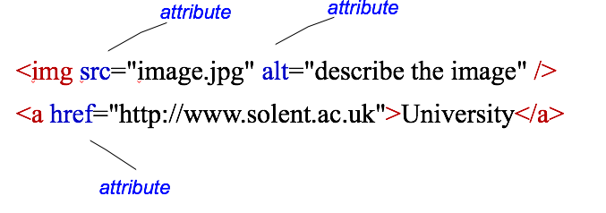

#Session 1  - HTML & CSS Review

The Web Design unit builds on your existing HTML/CSS skills. It extends the concepts learnt in internet technology. In order to make sure everyone is up to speed, in this session we'll focus on revising some of the HTML/CSS essentials. 

##Structure of an HTML page

An HTML document is made up of elements
 
 - elements are containers for content
 - everything from the start tag to the end tag
 - some types of element may contain other elements

Each HTML page must be saved with a **.html** extension

```html 
<!DOCTYPE html>
<html>
      <head>
	<title>my first page</title>
      </head>
      <body>
			<h1>This is my first Web Page</h1>
			<p>I should write a paragraph about myself</p>
			
			<a href="http://www.solent.ac.uk">University</a>
      </body>
</html>

```

###Attributes 

 - Each element may have one or more attributes
	- provide additional information about elements
   - specified in the start tag



##Common Page Elements 

```html
...
<!-- I am a comment --> 
<div id="wrapper"> 
	<h1> I'm a heading </h1>  <!-- there should be only one h1 -->
	<p>I'm  a paragraph</p>
	<h2> This is a list </h2>
	<ul>  <!-- this is an unordered list -->
		<li> List item 1</li>
		<li> List item 2 </li>
		<li> List item 3 </li>
	</ul> <!-- end list -->	
	
	<a href="/home.html"> Click me </a> 
</div> <!-- [END] #wrapper --> 

...
```


##CSS 

<iframe height='265' scrolling='no' src='//codepen.io/joeappleton18/embed/zKxXEj/?height=265&theme-id=0&default-tab=html,result&embed-version=2' frameborder='no' allowtransparency='true' allowfullscreen='true' style='width: 100%;'>See the Pen <a href='https://codepen.io/joeappleton18/pen/zKxXEj/'>A Basic HTML Page</a> by Joe Appleton (<a href='http://codepen.io/joeappleton18'>@joeappleton18</a>) on <a href='http://codepen.io'>CodePen</a>


##Styling page elements 

###Directly styling an element 
###Classes divs 
###Common attributes 
###CSS positioning 


Please only use external styles for this task. 

##Task 1  - Style up your week one page

**Set up**  

* Inside your `internet_tech` directory create a `session4` folder. 
* Copy your webpage from **session1** into the `session4` folder you just created. 
* Create a new style sheet and `<link>` it into your webpage. It's a good idea to place the style sheet in a new folder e.g. `css`. 

**Let's make your page look a little but more presentable**

Please go wild and style the page as much as you like, but as a minimum I want to see you complete the below tasks. Once done your page should resemble the layout below:


* Section up your site using a minimum of 3 `<div>'s `#left_nav`, `#section` and `#wrapper` which holds all the content.
* To start with give `#left_nav` a width of **20%** and `#section` a width of **80%**.
* Give `#wrapper` a width of **80%** and centre align it using `#wrapper {margin: 0 auto;}` 
* Add a different `background-color` to  `#left_nav` and `#section`.
* Use `float` to position  `#left_nav` and `#section` side by side, as per the mock up above. 
* Use a `<ul>...</ul>` to create a basic navigation list in `#left_nav`. Have at least 3 links, but you don't need to create the corresponding pages. Here's how to create a placeholder link: `<a href="#">  Home </a>`
* Apply some pseudo classes to your links, so they change colour based on their status. Below is an example: 

		     a:link {color:#FF0000;}      /* unvisited link */   
			 a:visited {color:#00FF00;}   /* visited link */   
			 a:hover {color:#FF00FF;}     /* mouse over link */   
   		     a:active {color:#0000FF;}    /* selected link */  
   		    
* Resize the image and centre align it.
* Remove the bullet points from the `<ul>` nav list **(Optional)** 
										

##Task 2 - Update your learning log
Don't forget once you're done update your learning_log.html and link to your new page in the evidence section of the table. 


