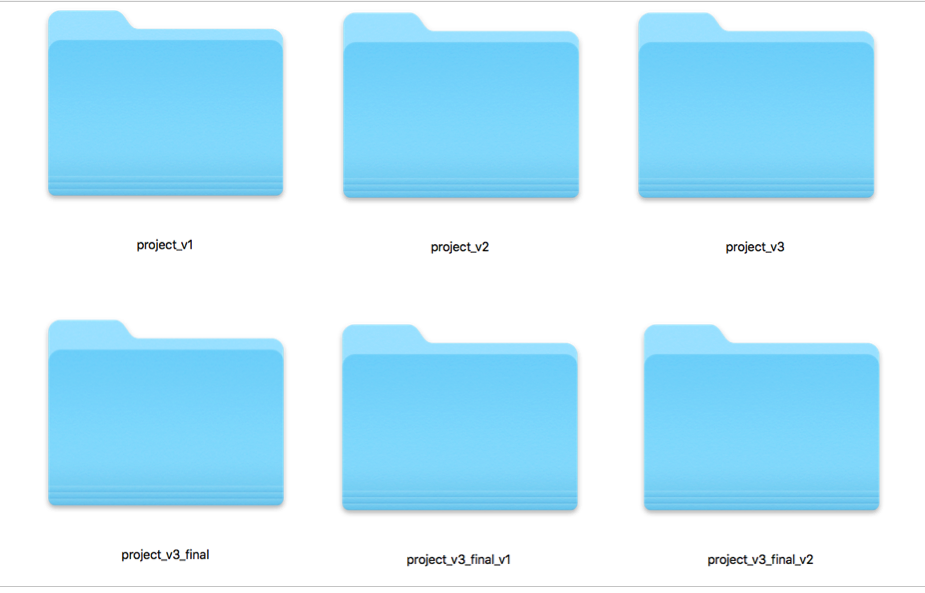
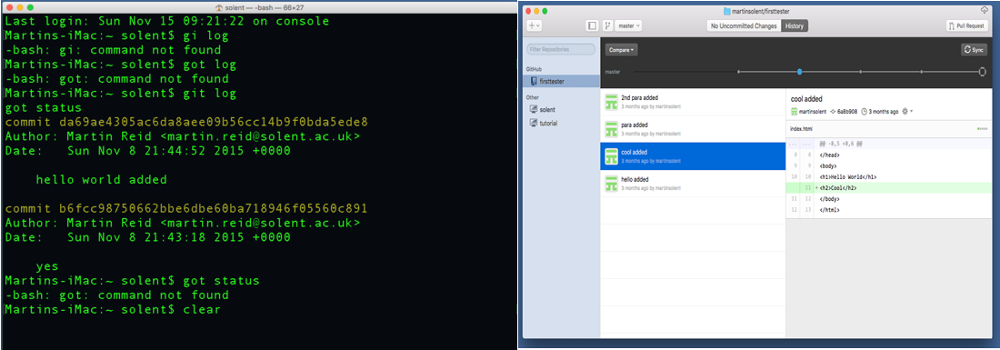
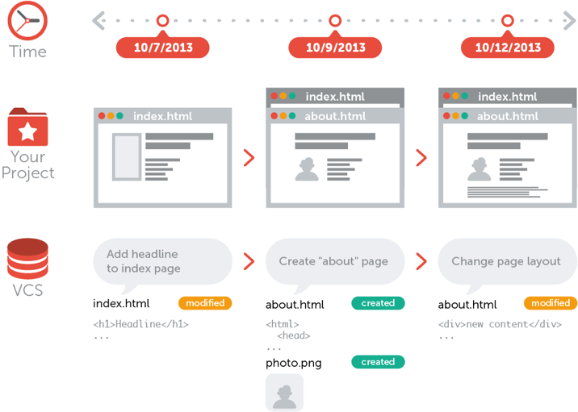

#Introduction to Version Control with Git & Git Hub 

#What is version control?

Why version control? Put simply, it's just a way of keeping track of past versions of your work. This allows you to revert back to previous versions of your work should any disasters happen!

You may have already used some crude version control systems:

##Multiple folder version control

When you working on a project you might say different versions with multiple duplicate folders or documents without a system of documenting your changes things can get out of hand and work can be lost or overwritten

>> This can quickly get out of hand!

##Using the cloud 

Again people may use cloud storage for saving their work and controlling different versions this is good that certain types of projects but if you’re working collaboratively or on complicated projects you will run into issues and also you still do not have any way of organising or recording changes or be able to see an overall map of your project
	

>> The cloud falls down for development project as we need a detailed change log and the ability to revoke those changes.

#Enter version control!

To avoid the above pitfalls we need to use a version control system. 

##The history of version control

### 1975 - First source code control system developed

Marc Rochkind develops source code control system (SCCS) in 1971 and publishes a paper on his work in 1975. What is outlined in the abstract is exactly what defines version control over 40 years later. **So version control is not exactly the new kid on the block**

####It provides facilities for storing, updating, and retrieving all versions of modules, for controlling updating privileges, for identifying load modules by version number, and for recording who made each software change, when and where it was made, and why.

### 1991 - Linux 

>> Linus Torvalds created the first version of Linux

- Based on UNIX, Linix appears in 1991, it's an  free open source operating system based on UNIX

- Over time thousands of developers start working on the project

- There needed to be a better way to share work among different developers 

### 1998 - BitKeeper 

- The LINUX development team uses the then the Source version control: bit keeper

### 2005 - BitKeeper is no longer free and open source 

- In 2005, BitMover announced that it would stop providing a version of BitKeeper free of charge to the community

- This move contradicts the open source Linux culture

### 2005 - The Git project is launched 

- The Git project was launched with the intent of becoming the Linux kernel's source code management software, and was eventually adopted by Linux developers.

#Enter GIT 

As of 2016, GIT is one of the most widely used version control systems in the world.

##Key features

###Free and open source 

GIT is free to use and is  open source. It's source code is managed using GIT!

###GIT is a distributed version control system

Every developer working on the project has a a full history of all the changes made. This means features can be developed locally and then pushed to a central location. 

###Allows a feature based workflow

GIT allows you to in effect create a separate version of the project and experiment with new features. Once you're happy with this new functionality you can **merge** the changes back into the original project. If you break something, you can easily discard any changes that you've made. 

#How Git works 

At this stage we're not going to look at the finer specifics of how to configure and use GIT. We want to give you an overview of how git works:

###Command Line or GUI?

Once GIT is installed there are two ways of using it, command line or the GUI application. We'll focus more on command line as this is generally how git is used in industry.

##A Repository `git init`

- When you start a new project you run the command `git init` within your projects root folder. This creates an empty git repository.
- A kind of database where your project is stored. Changes made to your project are stored in this database. 

>> Git will now be tracking all changes within your project folder

##Committing changes `git commit`

 - When we've got to a stage in a project where we want to in essentially, make a back up. We:
 	- Stage the files we want to commit,  
 		- `git add -A` stages all the files for commit 
 		- `git add sample.txt` stages just sample.txt for commit
 	- We now can take a snapshot of our project by running `git commit -m "set up home page"` notice how we add a message to the commit, this should be a short description of the work you have completed for this commit. 

 	

 

#Resources

- [GitHub introductory guide](https://guides.github.com/activities/hello-world/)
- [Git training guide video](https://www.youtube.com/watch?v=U8GBXvdmHT4)