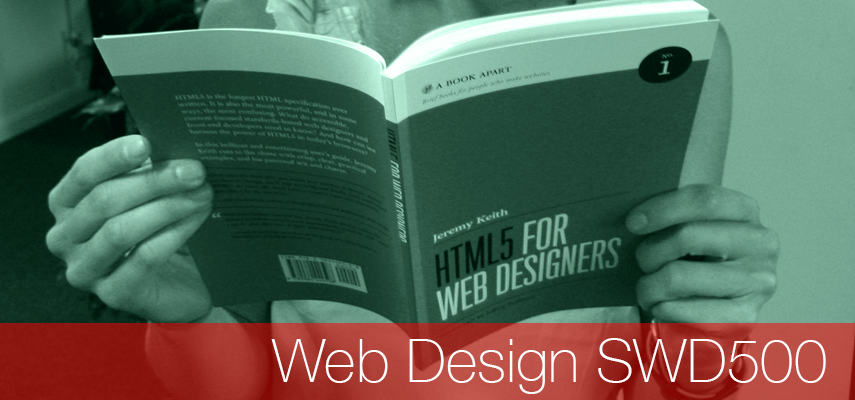

# Welcome Web Design SWD500

 - [About the Unit](#about-the-unit)
 - [Unit Team](#unit-team)
 - [Assessment Information & Assignment Briefs](#assessment_information_&_assignment_briefs)  
 

#About the Unit 

[image: Jeremy Keith  - Creative Commons] (https://www.flickr.com/photos/adactio/albums/72157624250812775)

This **20 credit** unit will build on the skills acquired at Level 4 in: planning, design/design theory and technical skills to create modern responsive websites and apps.

Areas covered: semantic HTML 5 markup, presentation layer styling using CSS3, interactive behaviours with JavaScript, responsive and mobile first design methods, media queries and an introduction to  Version Control with GIT and GitHub.

#Unit Team

- Joe Appleton – Unit Leader	
#Assessment Information & Assignment Briefs

Both assigned cover the research, design and implementation of a modern responsive website on the topic of your choice.

##Assessment 1 

[Assessment 1 Specification](https://github.com/martinsolent/swd500/blob/master/SWD500_Briefs_2017/swd500_AE1_2017.md)

<iframe width="350" height="180" src="https://w2.countingdownto.com/1510370" frameborder="0"></iframe>

The first assessment due in on **Friday 11th November 2016 22:00hrs** will included a project introduction, aims and objectives, research methods and planning and is worth 30% of the mark, This assignment is a report and should be structured in the same way you produced reports in the first year; research, reference sources, rough idea sketches and wire-framing.

##Assessment 2

[Assessment 2 Specification](https://github.com/martinsolent/swd500/blob/master/SWD500_Briefs_2017/swd500_AE2_2017.md)

<iframe width="350" height="180" src="https://w2.countingdownto.com/1510360" frameborder="0"></iframe>

The second assessment covers implementation of the fully responsive website, research and planned in AE1. You are also required to submit a revisited criteria of success that was also delivered within the AE1 and evidence that the site is responsive and works on a wide range of devices, This assessment is due in on **Friday 13th January 2017 by 22:00hrs** and is worth 70% of the mark.

It is important that you adhere to current web standards and your production methods are focused on hand coding and scripting, rather than the reliance of frameworks or off-the-peg templates and JavaScript libraries. To support this authentic approach you are required to document your scripting by using comments:

