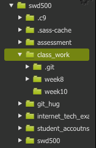

>> Important, all of your class work should now be under version control. At the end of each session you should be pushing your work up to gitHub. If you're confused about this please ask us and we an help you. 

**When I display hidden files, this is what my folder structure looks like**

The presence of the `.git` folder , means that all of the sub folders and files in  `class_work` are under version control.

#Set Up 

1) Within your `class_work` file, create a new folder and call it `week10`.

2) Open a terminal window and navigate to your `week10` folder.

3) Run the command `npm-init` and go through project options. 

4) We now need to install jQuery, so that we can use it in our project. Run the following command in your `week10` project directly:
	
	`npm install --save jquery`

If you look in your `node_modules`  directory and everything ran correctly. You should see that there is now a folder called `jQuery`. 

5) You can now include jQuery into our webpage in the normal way. 

``

    

