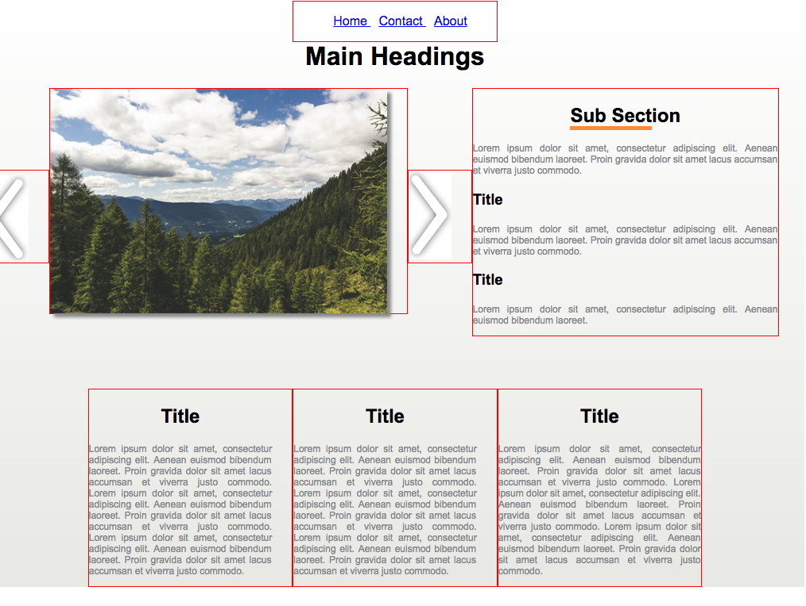

#Making a carousel using jQuery




#Set Up 

1) Within your `class_work` file, create a new folder and call it `week10`.

2) Open a terminal window and navigate to your `week10` folder.

3) Run the command `npm-init` and go through project options. 

4) We now need to install jQuery, so that we can use it in our project. Run the following command in your `week10` project directory:
	
	`npm install --save jquery`

If you look in your `node_modules`  directory and everything ran correctly. You should see that there is now a folder called `jQuery`. 

5) You can now include jQuery into your webpage in the normal way. 

`<script type="text/javascript" src="node_modules/jquery/dist/jquery.js"></script>`

   
6) Create the file `js/main.js` and include it in your html page below your inclusion of jQuery. 

7) In main.js create a [document ready function](https://github.com/joeappleton18/swd500/blob/master/live_course_git_hub/Sessions/session10.1/notes.md#document-ready-function). Within it place the line of code:


```html 
alert('hello world')

```

if everything has gone correctly it you should see a hello world alert box

8) You're going to need some images for this practical. Download them from (here)[https://github.com/joeappleton18/swd500/tree/master/live_course_git_hub/Sessions/session10.1/practical/images] and place them in a `images` directory 

#Main Task 

We're going to make a carousel using jQuery. Use your responsive website that you've made in the past lesson. If you don't have it you can download mine from [here](http://codepen.io/joeappleton18/pen/VKqdbX) to get you started.


1) Add the left and right arrows to your website so the resemble the above image

2) Set the src of the image to `/image_1.jpg`

3) We need some variables to track our carousel. At the top of `main.js` create the following variables:

```html
var currentIndex = 1;  
var max = 3;
var min = 1;
var imageFolder = 'images/';
var extension  = '.jpg';
```

4) Within your js file assign [click events](https://github.com/joeappleton18/swd500/blob/master/live_course_git_hub/Sessions/session10.1/notes.md#assigning-event-listeners) to the both of the arrows. You'll need to give them an id. See if you can write to the console when they're clicked

5) Now the hard part, we need to make the carousel slide. Recall`currentIndex = 1` and our starting image is `image_1.jpg`

- When the right arrow is clicked we want to [increase](https://github.com/joeappleton18/swd500/blob/master/live_course_git_hub/Sessions/session10.0/notes.md#maths-operators) the `currentIndex` by 1 
-  Next, implement a check using a conditional [statement](https://github.com/joeappleton18/swd500/blob/master/live_course_git_hub/Sessions/session10.0/notes.md#conditional-statements).  If the `curentIndex` is bigger than `max` set `currentIndex=min`
	
- 	Now using the index create a new image src and assigned it to a new variable `var new_image`. Notice that all of the images have a similar naming convention:

	- image_1.jpg
	- imgage_2.jpg
	- image_3.jpg

- Use [string concatenation](https://github.com/joeappleton18/swd500/blob/master/live_course_git_hub/Sessions/session10.0/notes.md#rules-for-javascript-variables) to create new path. Remember we have already set up variable for `imageFolder` and  `extension`

- Finally,  assign the new path [the src of your carousel image](https://github.com/joeappleton18/swd500/blob/master/live_course_git_hub/Sessions/session10.1/notes.md#accessing-attributes) 

5) Now, use similar techniques as above to create the functionality for the left arrow
