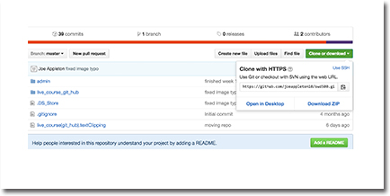

##Upping your GIT game 

So far we know the basics of how git works, this session will take a deeper look at some of the slightly more advanced features that make git so powerful. 


##Git Remote Repositories 

- One of the true powers of working with GIT 
- They allow us to store our work in any location that is running a GIT server
- You'll never lose your work 
- [www.github.com](www.github.com), the most popular remote host

###Using GitHub as a remote host 



>> <sub> Getting the remote address of a repository </sub>

###Git Clone

- If you wan't a carbon copy of a repository by running, `git clone <address>
` 
- If you run `git clone https://github.com/joeappleton18/swd500.git` you'll get a full carbon copy of the entire repository containing the course material on your local computer 


###Two way communication 

- Git Clone is fine if we just want to pull a project directly off GITHUb and store it locally. 
-  Most of the time you'll want to send changes back to GITHub for safe keeping
	
**Git makes this easy:**

- Get the remote address of your repository, as shown in the diagram above
- Locally create a empty folder to hold your project 
-  Then locate this folder from your shell application and run the following commands

```bash 
git init 
git remote add origin <remote address>
```

As you can see `git remote` takes two arguments  
	- The remote name, `origin` in this case. This is so we can easily reference the remote without having to remember the full address 
	- Running `git remote -v`, will display your remote address

	

We can now `push` and `pull` to the remote host

- `git pull origin master`  //pulls files from the origin 
- `git push origin master` // sends files to origin  

The typical workflow would be:

- **Pull** from the origin, work locally and make regular commits
- When you end your work session, **push** the changes to the origin for safe keeping 
	
	
	
##How to Undo Things 

In reality it's unlikely you'll need to roll back to older versions of your project. For example, let's assume for some reason your program is broken. A common is to find a older working commit and then comparing the difference between the working and broke version. GIT makes this very easy:

- Run `git log` to pull up your list of commits 
- Pick a commit to temporally roll back to and `git checkout <commit hash>`
- Git will inform you that the head is now in a detached state. Your  project will now resemble the exact state that it was in at that commit
- Run git `checkout master` to restore your most current version 
- You can keep repeating this process until you find a working commit
- When you find a working version you can run `git diff <commit code>`, this will highlight the differences between the working commit and the current version of the project


##`git checkout -- <file name> `


- Gets rid of changes made to a specific file since the last commit 
-  `git checkout -- <file name> ` will reset a file to its state to when it was committed last


##`git reset --hard`

- `git reset --hard` will reset all the file in the working directory back to how they were in the last commit 


##`git revert <commit id>`


- `git revert <commit id>` creates a new commit that mirrors an old commit


