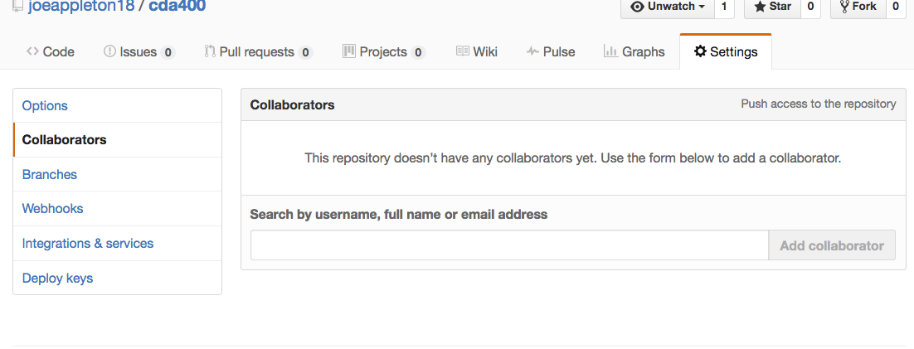

#1 Git Collaboration 

The purpose of this practical is to simulate how a collaborative git work flow would operate in the real word.  

- Nominate a team leader **you can form one group or use smaller sub groups**
- The team leader should create a public git repository and grant access to the repository to everyone else in the team. This can be done from the repository settings  

- Everyone on the team should create a local repository and add the remote of the new repository set up by the team leader
- Each team member should then create a new branch based on the name, using the following convention `firstname_lastname`
- Next, create a `firstname_lastname.md` file within it you include the following:

	- Your name
	- Research what is meant by workflow in GIT?
	- What workflow will you use for your responsive website  	
	
**You'll need to conduct your own research on how to do the below**

- When your done commit your changes and push the `firstname_lastname` branch (**not, the master branch**) to the origin	
- Go to gitHub and raise a pull request on your branch 
- Help the team leader merge your pull request into the master branch, this should be done from within gitHub. 
