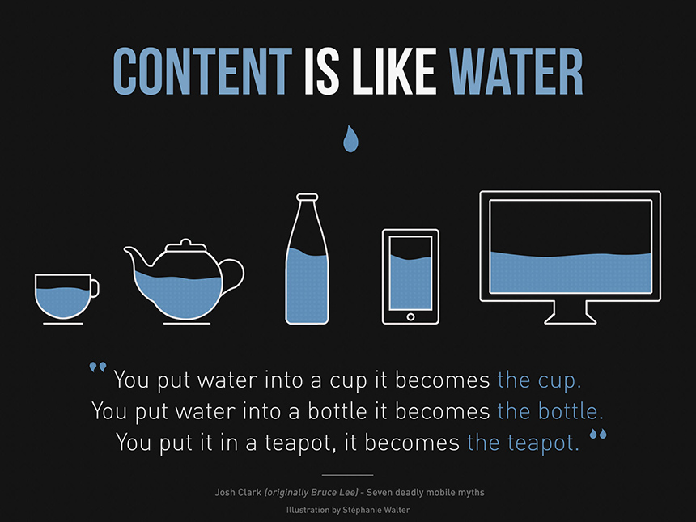

####Viewport Meta Tag


- When making responsive websites we use this tag to set the viewport to the width of the device that is being used

- This will allow us to implement CSS that responds to the width of the viewport 


```html 
<meta name="viewport" content="width=device-width, initial-scale=1">
```


##Fluid grids 

>> "Fluid grids, flexible images, and media queries are the three technical ingredients for responsive web design, but it also requires a different way of thinking".
[Responsive web design article](http://alistapart.com/article/responsive-web-design)    




- Fluid grids flow and fit whatever device they are being viewed on, regardless of size. The the analogy of water being poured into different vessels is often used. 


##Designing a custom fluid grid 

- Fluid grids are based on the grid system of design. 
- This week we'll focus on designing our grid, next week we'll 


##Resources 


>> "Fluid grids, flexible images, and media queries are the three technical ingredients for responsive web design, but it also requires a different way of thinking".
>>

[HTML5 And The Document Outlining Algorithm](https://www.smashingmagazine.com/2011/08/html5-and-the-document-outlining-algorithm/)   
[Fluid Grids](www10.landg.com/ProtectionPortal/home.htm)

