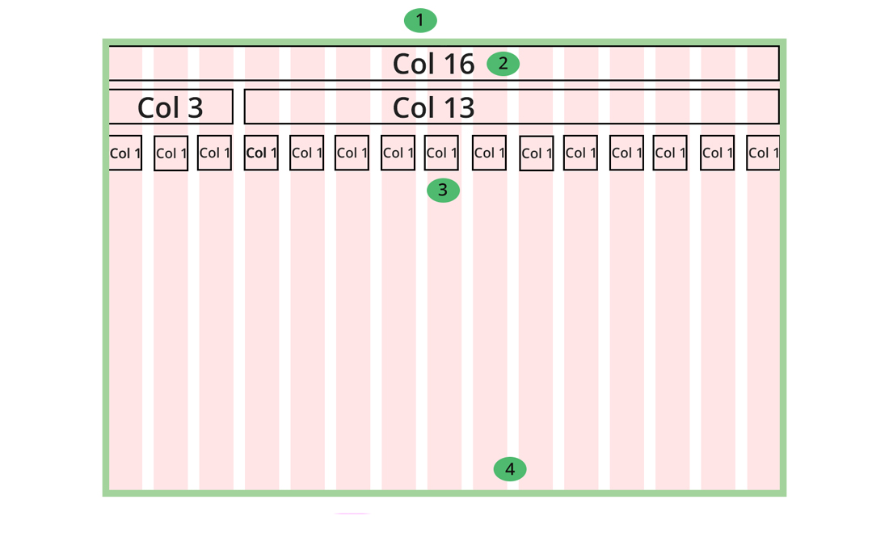

##Fluid grids 


This week we're looking at fluid grids and how to construct them using HTML.

**By the end of this week you'll:**

- Understand fluid grids and their place in responsive web design 
- Created your own HTML grid

**Important** you'll need to make sure that you complete the practical task in your own time if you don't finish it in the class sessions. 


>> "Fluid grids, flexible images, and media queries are the three technical ingredients for responsive web design, but it also requires a different way of thinking".  
[Responsive web design article](http://alistapart.com/article/responsive-web-design)    


- Fluid grids flow and fit whatever device they are being viewed on, regardless of size. The analogy of water being poured into dDifferent vessels often used. The water will take the shape of whatever vessel is being used


##Designing a custom fluid grid   

- Fluid grids are based on the grid system of design  
- You can generate a grid for photoshop using a tool like [Grid Calculator](http://gridcalculator.dk/#/960/16/20/20)   
- You can then use this grid to create your mock ups

##Creating a fluid grid in HTML 

- You'll need to experiment and create a fluid grid in HTML for you assessment


###Understanding the components of a fluid grid 

In this section we'll look at how to define css rules in order to create a custom grid. **Note**, the choices you make when creating your grid may be different to mine below: 





#####1) The wrapper 

This is very much like the wrapper div you may have used for making HTML pages so far. 


```css
.wrapper {
  display:table;
  max-width: 1200px;
  
}

```

- `width:100%` A % value ensures that our grid will shrink and grow based on the device it's being viewed on
- `display:table`, means that our floated columns don't collapse the outer `wrapper`  

>> [codepen example](https://codepen.io/joeappleton18/pen/RGBXQE)


#####2) The total number of columns


```css
.col-16 {
  width:100%;
}
```

- I've chosen 16 columns for my grid, however you can make your grid smaller or larger. It's considered good practice to make the grid a multiple of 3 and a minimum size of 6 columns. 


####3) A single grid column   
```
.col-1 {
  
  width: 6.25%;
  border: 1px solid red;  
  
}
```

- To work out the size of a single grid column we divide the wrapper width in this case 100% by the our number of columns 16
- We want our grid columns to layout side by side, we can target all of our cols by using the below rule. As long as we follow the format `col-<width>` all of our columns will be target with just one rule

```css
[class*='col-'] {
  float: left;
 }
```

###4) The gutters

Gutters are the spacing between our grid columns.  You can use a pixel  padding value to achieve this:

```css

[class*='col-'] {
  float: left;
  padding-right: 10px;
 }
```

-  You may recall the way the box model works, adding padding to any element actually increases its size. To ensure all of our elements remain the required size, we can use the `*` selector to assign ` box-sizing: border-box;` property to all of the elements on the page

```css

* {
    box-sizing: border-box;
}

```

- We may not want the final column in a row to have padding, we can generically target the last column in each row, like this:

```css
[class*='col-']:last-of-type {
  padding-right: 0;
}
```


####5) Defining a row 

In order make sure columns don't play nicely and don't overlap into other rows. We need to define a row class:


```
.row:before, 
.row:after {
     content:"";
     clear:both;
 }
 
```


We can now nest columns within rows:


```css
	<div class = "row"> 
		<div class = "col-10">
		
		 	<p> col 10 </p>
		
		</div> <!-- [END] .col-10 -->
		<div class = "col-6">
		
			<p> col 6 </p>
		
		</div> <!-- [END] .col-6 -->
	</div> <!-- [END] .row  -->
	<div class = "row">
	
			<div class = "col-16">
		
		 		<p> col 16 </p>
		
		  </div> <!-- [END] .col-16 -->
	
	</div>  <!--- [END] .row -->
 

```


**a code pen example of a part implemented grid [grid](https://codepen.io/joeappleton18/pen/WGgZXO)**


##Resources 
[W3Schools Grid Tutorial](http://www.w3schools.com/css/css_rwd_grid.asp)  
[Creating a Simple CSS Grid From Scratch](http://j4n.co/blog/Creating-your-own-css-grid-system)
[A Great Article on Creating Grids](https://css-tricks.com/dont-overthink-it-grids/)  
[HTML5 And The Document Outlining Algorithm](https://www.smashingmagazine.com/2011/08/html5-and-the-document-outlining-algorithm/)   
[Fluid Grids](www10.landg.com/ProtectionPortal/home.htm)

