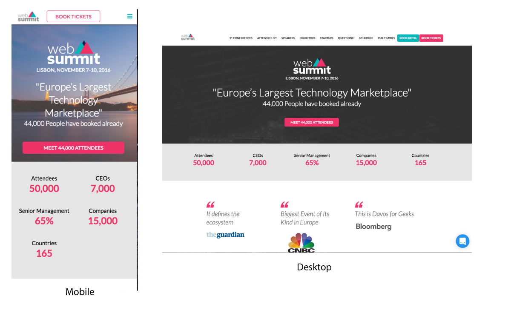
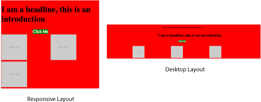

#The Power of Media Queries 


Media queries form one of the foundations of responsive design. They allow us to change the look and feel of our websites based on the device size that it's being viewed on. In order to effectively use media queries, we nee to make sure that the viewport is representative of the device width. We can achieve this by using the viewport meta tag:

`<meta name="viewport" content="width=device-width, initial-scale=1">`


```
@media (query) {
  /* we can then place rules in here */
}
```

>> The media query syntax, this can be placed in the style sheet


Using media queries we can check for `min-width`, `min-height` and `max-height`


#How media queries are used 

- As mentioned above we place our media queries in directly in the style sheet.   Consider the following example:

```html

body {
  
  background-color:green;
  
}

@media(max-width:500px) {
  body {
     background-color:yellow;
  }

}
```
>> [Code Pen Example](https://codepen.io/joeappleton18/pen/yaGqkK)


- The resulting outcome of the above media query is the background colour of our website will change to yellow when the viewport is smaller than or equal to 500px

- We can have multiple media queries in one CSS file to target different device sizes. Below are some common device sizes that we may want to target:

```html

    
    /* Custom, iPhone Retina */ 
    @media (max-width : 320px) {

    }

    /* Extra Small Devices, Phones */ 
    @media (max-width : 480px) {

    }

    /* Small Devices, Tablets */
    @media (max-width : 768px) {

    }

    /* Medium Devices, Desktops */
    @media (max-width : 992px) {

    }

    /* Large Devices, Wide Screens */
    @media (max-width : 1200px) {

    }
```

##Some common CSS media query tricks



>> https://websummit.net/

Consider the above website, broadly speaking the following changes happen on the mobile version of the site:

 - The top navigation menu is hidden 
 - The heading spans 100% 
 - The figures below the banner span 50% of the page


For examples sake, let's define single breakpoint of 758px and consider how we'd achieve something similar to the above layout. 

Below is our initial layout, you can see we've used a 12 column grid:




```html

	<div class="wrapper">
    <div class="row">
      
     <div class="col-4 offset-4"> 
        <ul id="top_menue">
          <li> Menue Item </li>
          <li> Menue Item  </li>
          <li> Menue Item </li>
          <li> Menue Item  </li>   
        </ul>  
      </div> <!-- ./col-4 --> 
      
    </div> <!-- ./.row -->
  
    <div class="row"> 
        <div class="col-5 offset-4"> 
         <h1> I am a headline, this is an introduction </h1>
         <a class="button"> Click Me</a>
       </div> <!-- ./.col-5 --> 
    </div> <!-- ./.row -->     

       
    <div class="row green top-spacer">
      <div class="col-3  offset-3"> 
          
      </div> <!-- ./col-4 -->  
        
      <div class="col-3"> 
        
      </div> <!-- ./col-4 -->   
        
      <div class="col-3"> 
        
      </div> <!-- ./col-4 --> 
   
    
    </div> <!-- ./.row -->  
      
</div> <!-- ./.wrapper -->


```


- Since we've used a grid, easily make our layout flexible

- The first thing we need to do is hide the top menu. We can achieve this by using the css `display:none` property:

```
@media (max-width : 768px) {
   #top_menu {display:none};  
 
 }
```

- **Note** , you can also use display `block` or `inline` to display a hidden element. 

-  Next, span the heading to 100%, let's consider the HTML structure surrounding the heading:

```  
      <div class="col-5 offset-4"> 
	       <h1> I am a headline, this is an introduction </h1>
	       <a class="button"> Click Me</a>
       </div> <!-- ./.col-5 --> 
```
- Since we used a grid, we can make global decisions that will effect all of our columns. On smaller devices, we're going to span all `col-5` class 100% and set all offsets to 0%.


```
@media (max-width : 768px) {
   #top_menu {display:none};
   .col-5 {   
   	   width: 100%;
   }
   
   [class*='offset-'] {
      padding-right: 0%;
  }  
 
 }
```

- Finally, we need to adjust the styling for the images below the click me button, we want two images per line on smaller devices. Again, since the are in a column (col-3), we can adjust their width:

``` 
@media (max-width : 768px) {
   #top_menu {display:none};
   
   .col-3 {
             width: 50%;
            
   }
   .col-5 {   
   	   width: 100%;
   }
   
  [class*='offset-'] {
        
         margin-left: 0%; 
  }  
  
 }
```
>> [Codepen Example](https://codepen.io/joeappleton18/pen/ozJRpp)


	
		
#Mobile first vs desktop first 

- Historically the most common approach to designing websites was to build the desktop version of the site first, then focus on making it mobile compatible. The type of approach is know as **desktop first**. This was fine as the majority users were accessing websites using desktop browsers. 

- Due to the proliferation of mobile devices, the design community now favours a mobile first approach to design. Adopting this approach involves building first for the mobile then progressively adding content and features for the larger versions on the site. This method forces us to focus on the most important features first. 

>> Mobile devices require software development teams to focus on only the most important data and actions in an application. 
[Luke Wroblewski, http://www.lukew.com/ff/entry.asp?933](Luke Wroblewski, http://www.lukew.com/ff/entry.asp?933)


#Resources 
[](https://developers.google.com/web/fundamentals/design-and-ui/responsive/)
[Responsive Media Queries](https://youtu.be/fA1NW-T1QXc)
