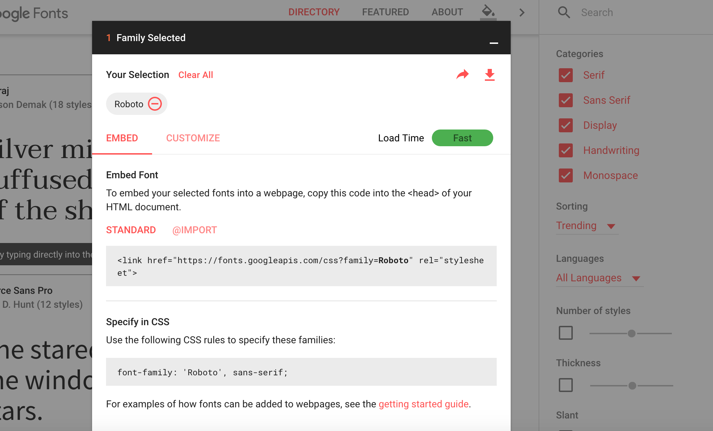

#Responsive Typography 

- Responsive typography involves us using techniques to make sure our text is readable on all devices

##Choosing your font 


>> fonts.google.com

- It's vital that you start by choosing a readable  
- If you don't want to use a standard font, it's possible to easily import from services like  [google fonts](http://fonts.google.com)


##Using CSS Viewport Units

- CSS3 allows us to resize things relative to the viewport size
- We can use the new units, vw , vh , min and vax

```
		1vw = 1% of viewport width
		1vh = 1% of viewport height
		1vmin = 1vw or 1vh, whichever is smaller
		1vmax = 1vw or 1vh, whichever is larger
```

- This makes it really easy for us to define site wide responsive fonts

```
	h1 {
	  font-size: 5.9vw;
	}
	h2 {
	  font-size: 3.0vh;
	}
	p {
	  font-size: 2vmin;
	}
```	

##Media Queries


- The most common methods for making our typography responsive is by using media queries

- You're probably used to setting the font size using a pixel value. However, when it comes to responsive design using an `em` unit is more common

-  `em` is relative to the size of the text that applies to it's parent element.  If there is no size set anywhere on the page then the browser default is used, which is often 16px.  
 
 ```
 	p {
			font-size: 1 em;  /** 1 em = 16px;
	
	}
	
	h1 {
		font-size: 2em;  /** 2 em = 32px (16 * 2)
	
	}
```	

- To create responsive typography we can embed our font size properties within media queries:

	```
	
	/* Extra Small Devices, Phones */ 
	@media (max-width : 480px) {
	    
		h1 {  
				font-size: 0.5em;
	
	   }
	
	```


#Flexible Images

Flexible images are one of the fundamentals of responsive design. You want to ensure that images resize relative to the viewport. We can achieve this by using the `max-width` css rule:


```html 
img {
   max-width: 100%;
   height: auto;
}
```

##Excluding large images for mobile devices

If you have a large image on your website, you may make the design choice to exclude the image or load in a lower resolution version of that image. This can be achieved by using media queries and the background css property. 

```
.img {
    background-image: url("my_image.jpg");
}

@media (max-width : 480px) {
    
	.img {  
			 background-image: "";
	
    }
}   
	
```


