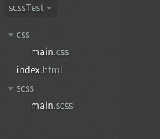
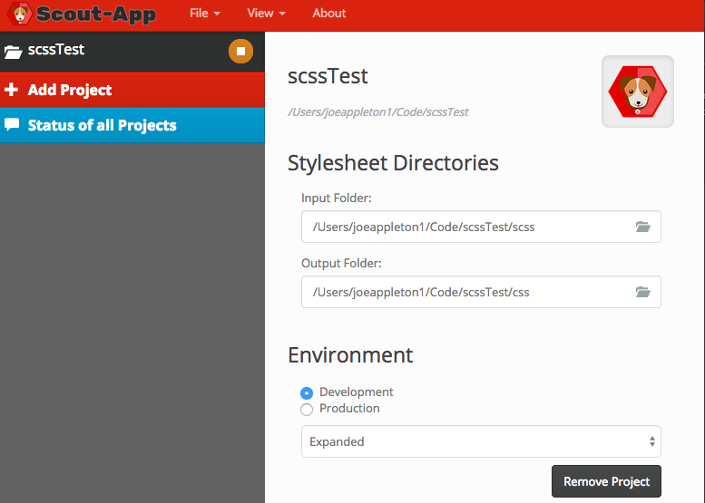

#Practical 1 - Getting started with SASS


 - Download [scout-app.io](http://scout-app.io) and store it in a safe place on your u drive
- On your `u` drive create a folder called `scssTest`, within this folder create two further folders **scss** and **css**
- Next, create the following files
			
	-  `css/main.css`
	-  `index.html`
	-  `scss/main.scss`
- You directory structure should resemble the following:



- Within scout, got to `file -> New Project`, and select your `scssTest` test folder.  Make sure your input folder is pointing to your `scss` folder and your output folder is pointing to your `css` folder



- Before we can use SASS we need to include the main.css file into our `index.html` page. Copy across the below html into you `index.html` file in order to do this.

```
<!doctype html>
<html>
<head>
    <meta charset="UTF-8">
    <title>Untitled Document</title>
    <link type="text/css" rel="stylesheet" href="css/main.css">
<body>

<p>This should be pink</p>

</body>
</html>

```

- To test out that scout-app is working input the below code into `main.scss` and press the play button in your `scout` app. 

- If you check your `main.css` file you should see your compiled code

#Practical 2 - Converting some legacy css into scss

-  A great way to learn sass is to take some existing CSS and enhance it using Sass rules
 
-  Download the following zip file from [here](https://github.com/joeappleton18/swd500/raw/master/live_course_git_hub/Sessions/session8.0/assets/scssPractical.zip) and save it on your u drive

-  Notice how main.scss currently just has normal css in it. Sass is just an extension of css so this is fine. 
- This template is somewhat old fashioned, so we're going to progressively enhance it using sass. 
**Consider the following**

- Currently the light green colour `#A1B449` is repeated throughout the style sheet. Declare a variable called `$light_green` and assign the hex value `#A1B449` to it. Replace any instance of `#A1B449`  in the style sheet with the variable.  


- Play around and change the value of `$light_green`, we can now control every instance of this colour in one place. 


- Notice how the `#sidebar` selector has multiple descendant selectors. In sass these can be nested within the `#sidebar` declaration. Go ahead and try and do this, below I've nested the `h1` to help you get started

```
#sidebar {
    
h1
{margin:20px 18px 0 5px; color:$light_green; font-size:1.6em; letter-spacing:-2px; text-align:right;}

..... /*further nested rules can go here */
    
}


```

- Notice how h2 and h3 share the same styles. We then go on to define further h3 styles below. See if you can use sass so h2 extends h3

- Nest the `#` menu along with its pseudo classes such as hover

- See if you can make any further enhancements using `scss`
